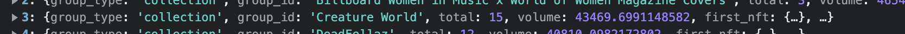
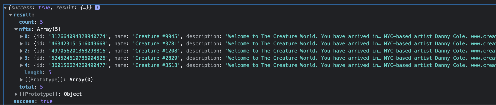

# FTX NFT Marketplace Take Home Project 
# Initial Acceptance Criteria
 - User should be able to browse a list of collections
 - User should be able to browse individual NFTs within a collection 
### Additional features I added
 - User can use search bar to filter NFT collections 
 - User can click on an NFT within a collection to view that NFT's details 
# Dependencies 
 - React.JS
 - Material UI 
 - Axios 
 - React Testing Library 
 - Jest 
# How to set up 
1. Clone the repo:
    ```
    git clone https://github.com/HenryQuillin/nft-marketplace.git
    ```
 2. Navigate to the project file: 
    ```
    cd nft-marketplace
    ```
2. Make sure you have yarn installed. If you don't, run 
    ```
    npm install yarn
    ```
3. Install the dependencies 
    ```
    yarn install 
    ```
4. Install the [Moesif Origin & CORS Changer Chrome extension](https://chrome.google.com/webstore/detail/moesif-origin-cors-change/digfbfaphojjndkpccljibejjbppifbc?hl=en-US#:~:text=Moesif%20Origin%20%26%20CORS%20Changer&text=This%20plugin%20allows%20you%20to,without%20receiving%20Cross%20Origin%20Errors.).
	If you do not do this, you may get this error when trying to make a request to the FTX API: 
    ```
    Access to XMLHttpRequest at 'https://ftx.us/api/nft/collections_page?startInclusive=25&endExclusive=50&collectionsType=all' from origin 'http://localhost:3000' has been blocked by CORS policy: No 'Access-Control-Allow-Origin' header is present on the requested resource.
   ```
5. Turn on the Moesif extension
6. Start the react app 
    ```
    yarn run start 
    ```

# Issues 
 Either I am doing something wrong in my GET request, or there are some discrepancies in the API data. 
 For example, in the https://ftx.us/api/nft/collections_page endpoint, it returns an object saying that there are a total of 15 NFTs in the 'Creature World' collection.  . However, the https://ftx.us/api/nft/nfts_filtered endpoint returns an object with only 5 NFTs in the 'Creature World' collection.  . 
 This led to an issue where a card on the collection page may say there are a total of, say 13 NFTS, in a collection, but when you click on the collection card there are actually no NFTs in that collection. 
 If my GET request was invlaid, I would either get a 404 error or I would get an empty object, so the fact that I am getting some NFT data back makes me think that my request is not the issue. If I had more time, a possible solution would be to call to the ftx.us/api/nft/nfts_filtered endpoint in getCollectionsData.js to get the actual total of NFTs in each collection.
# Decisions and tradeoffs 
### Global State 
- I decided against using a global state management tool like Redux because it would introduce a lot of superfluous boilerplate code. Not only is this a very small project, but all the state variables flow one way -- making a global state unnecessary. 
### Pagination 
- There were a couple ways I could have implemented pagination for the collections page. One idea I had was to request all the collection data from the API, and then filter the shown collections separately according to the page (i.e 1, 2, 3, etc...) the user has selected. This would make switching to different pages (the page of the collections grid, not the url) faster. However, this would also greatly increase the initial page load time. 
- Instead of doing this, I decided to only query the data for the current page, and make a new request every time the user selects a different page. My thought process is that we don't know whether the user will actually switch pages, so while the user who searches through a ton of the collection pages will have to wait longer, most users --who only look through one or two pages-- will enjoy the faster initial load time.  
# What I would do if I had more time 
- Increase test coverage
- Add a dropdown that allows the use to select a different # of items per page
- Implement a skeleton card animation instead of a circular spinner while the data is loading 
- Add a dropdown that allows the user to filter collections by currency type 
- Add a dropdown that allows the user to sort NFTs by price
- Implement pagination for the NFT grid page
- Add a loading icon to the NFT details page 

# Contact 
- I appreciate this opportunity! I really enjoyed working on this project :)
- Get back to me at henryquillin@gmail.com or 2817809531 
